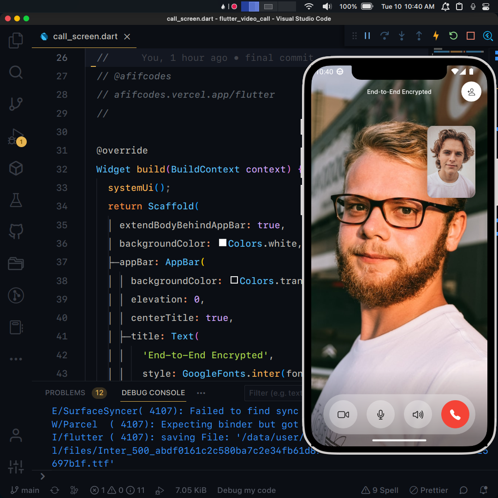

## Flutter UI - Video Call

```dart
void main() => runApp(const MaterialApp(
      debugShowCheckedModeBanner: false,
      home: CallScreen(),
    ));
```

## Development Setup
```
git clone https://github.com/afifcodes/flutter-video-call.git
cd flutter-video-call
flutter pub get
flutter run
```

## Screenshots


## Links

* [Website](https://afifcodes.vercel.app/flutter)
* [Youtube channel](https://youtube.com/afifcodes)
* [Instagram](https://instagram.com/afifcodes)
